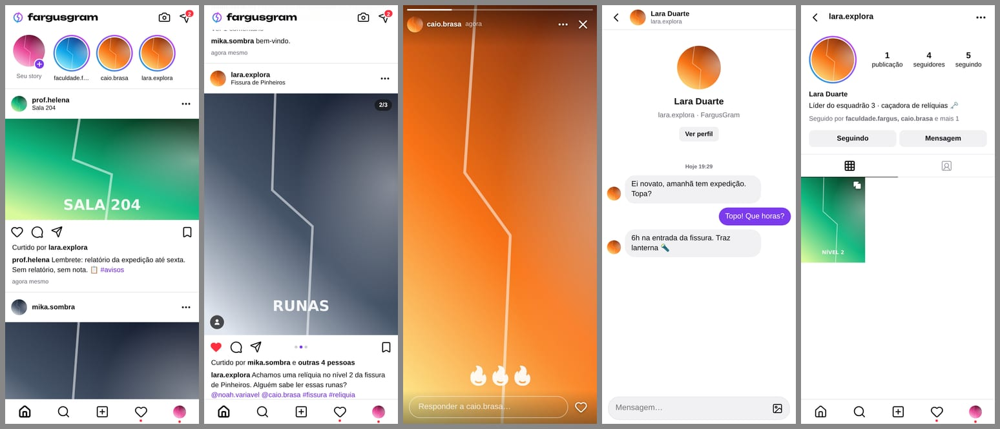

# FargusGram

A rede social dos personagens da campanha Fargus. Funciona no navegador e se instala no celular como um app, no iPhone e no Android, sem pagar nada.



## O que tem

- Feed com publicações de até 10 fotos, com recorte e filtros
- Curtir com toque duplo, comentar e responder comentários, salvar e mandar no Direct
- Stories de 24 horas (foto ou texto), com lista de quem viu e respostas
- Destaques no perfil: stories guardados com nome e capa, que ficam no perfil para sempre
- Música nos posts e nos stories: busca no catálogo do Apple Music, escolha do trecho de 15 segundos e adesivo da música no story
- Perfis, seguidores, marcação de personagens nas fotos, @menções e #hashtags
- Explorar, com busca de personagens e hashtags
- Notificações de curtidas, comentários, respostas, menções, marcações e seguidores
- Notificações no celular (mesmo com o app fechado), com número no ícone do app e escolha do que receber
- Direct com conversas individuais e grupos, inclusive com fotos, e respostas a uma mensagem específica
- Notas no topo do Direct: um recado curto (com música, se quiser) que dura 24 horas
- Melhores amigos: cada personagem monta a sua lista secreta e pode mandar stories e notas só para ela (anel verde)
- Cada jogador pode ter vários personagens e alternar entre eles. O mestre usa isso para os NPCs.
- Selo de verificado, dado pelo admin
- Modo escuro
- Cadastro só com código de convite
- Painel do admin: trocar o convite, ver jogadores, redefinir senhas, dar selos e apagar qualquer publicação

## Como funciona

O app é um site feito em React, hospedado de graça no GitHub Pages. Os dados e as fotos ficam no Supabase, também no plano grátis. No celular ele vira um PWA: a pessoa adiciona o site à tela inicial e ele abre em tela cheia, com ícone próprio, como um app normal. Publicar na App Store custaria US$ 99 por ano e na Play Store US$ 25, por isso usamos esse caminho.

## Colocar no ar

Leva uns 20 minutos, uma vez só.

### 1. Criar o projeto no Supabase

1. Crie uma conta em [supabase.com](https://supabase.com). Dá para entrar com a conta do GitHub.
2. Clique em **New project**. Use o nome `fargusgram`, crie uma senha para o banco (guarde, mas o app não usa) e escolha a região **South America (São Paulo)**.
3. Espere um ou dois minutos até o projeto ficar pronto.

### 2. Criar o banco de dados

1. No menu lateral, abra **SQL Editor** e clique em **New query**.
2. Abra o arquivo `supabase/setup.sql`, copie tudo, cole no editor e clique em **Run**.
3. No fim deve aparecer `FargusGram: banco configurado com sucesso ✔`.

O Supabase pode avisar que o script tem comandos "destrutivos". Pode confirmar: ele só apaga e recria as próprias regras de segurança, nunca os seus dados. O script pode ser rodado de novo quando quiser.

Quem instala do zero não precisa rodar mais nada: o `setup.sql` já inclui todas as atualizações da pasta `supabase/atualizacoes/`.

### 3. Desligar a confirmação de e-mail

O envio de e-mails grátis do Supabase só funciona para os membros da equipe do projeto. Se a confirmação de e-mail ficar ligada, seus amigos não conseguem terminar o cadastro.

1. Abra **Authentication** → **Sign In / Providers** → **Email**.
2. Desligue **Confirm email** e salve.

### 4. Ligar o app ao seu Supabase

1. No topo do projeto, clique em **Connect**. A URL também fica em **Project Settings** → **Data API** e a chave em **Project Settings** → **API Keys**.
2. Copie a **Project URL** (algo como `https://abcdxyz.supabase.co`) e a **publishable key** (começa com `sb_publishable_`). Se o seu projeto só mostrar a chave `anon`, pode usar ela.
3. Abra `src/config.js` e cole os dois valores no lugar indicado.

Esses dois valores são públicos por natureza, porque vão para o celular de todo mundo. Quem protege os dados são as regras de segurança criadas pelo `setup.sql`: só quem entrou com o código de convite consegue ver ou publicar qualquer coisa. Nunca coloque no app a chave `secret` ou `service_role`.

### 5. Publicar no GitHub Pages

O código fica no repositório [EnricoDiGioia/FargusGram](https://github.com/EnricoDiGioia/FargusGram). Ele precisa ser **público**, porque o GitHub Pages gratuito só funciona assim.

1. No repositório, abra **Settings** → **Pages** e, em **Build and deployment** → **Source**, confira que está **GitHub Actions**.
2. Abra a aba **Actions** e espere o "Publicar no GitHub Pages" ficar verde. Se alguma execução falhar por ter rodado antes do passo 1, abra a execução e clique em **Re-run all jobs** (ou escolha o fluxo na lista e clique em **Run workflow**).
3. O site fica em `https://enricodigioia.github.io/FargusGram/`.

Toda vez que alguém der push na branch `main`, o site é publicado de novo sozinho. Para mudar só o `src/config.js`, dá para editar direto no site do GitHub: abra o arquivo, clique no lápis, cole os valores e confirme o commit.

Para trabalhar no código no seu computador:

```powershell
cd D:\GithubProjects
git clone https://github.com/EnricoDiGioia/FargusGram.git
```

Se você já tiver a pasta `D:\GithubProjects\FargusGram` sem o Git, dá para ligá-la ao repositório assim:

```powershell
cd D:\GithubProjects\FargusGram
git init -b main
git remote add origin https://github.com/EnricoDiGioia/FargusGram.git
git fetch origin
git reset --hard origin/main
```

### 6. Primeiro acesso

1. Abra o site e toque em **Cadastre-se**. O código de convite inicial é `fargus`.
2. A primeira conta criada vira admin. Depois é só criar o seu personagem.
3. No seu perfil, toque em ☰ → **Painel do admin**. Troque o código de convite e toque em **Copiar link de convite** para mandar no grupo. O link já abre o cadastro com o código preenchido.
4. Se o mestre também for cuidar do app, use **Tornar admin** na conta dele.

### 7. Instalar no celular

**iPhone:** abra o link no **Safari**, toque em **Compartilhar** e depois em **Adicionar à Tela de Início**. Tem que ser o Safari: se o link abrir dentro do WhatsApp ou do Instagram, copie e cole no Safari. No iPhone, o app instalado pede login de novo na primeira vez.

**Android:** abra o link no **Chrome**, toque no menu ⋮ e depois em **Instalar app** (em alguns aparelhos aparece como **Adicionar à tela inicial**).

O próprio app mostra essas instruções na tela inicial para quem ainda não instalou.

Para os avisos chegarem no celular, falta criar a função `push` no Supabase: veja [Notificações no celular](#notificações-no-celular).

## Atualizações do banco

Quando uma novidade do app precisa de algo novo no banco, ela vem num arquivo separado dentro de `supabase/atualizacoes/`. Quem já tinha o FargusGram funcionando roda esse arquivo uma vez:

1. No Supabase, abra **SQL Editor** e clique em **New query**.
2. Copie todo o conteúdo do arquivo, cole no editor e clique em **Run**.
3. No fim aparece uma mensagem com ✔.

Esses arquivos não apagam nada e podem ser rodados mais de uma vez sem problema. Enquanto a atualização não for rodada, o resto do app continua funcionando normalmente; só a novidade avisa que falta atualizar o banco.

| Arquivo | O que traz |
| --- | --- |
| `2026-09-musica.sql` | Música nos posts e nos stories |
| `2026-09-notificacoes.sql` | Notificações no celular (depois, crie a função `push`, veja abaixo) |
| `2026-09-respostas.sql` | Responder uma mensagem específica no Direct (rode depois da de notificações) |
| `2026-09-destaques-notas.sql` | Destaques no perfil e notas no Direct (rode depois das anteriores) |
| `2026-09-melhores-amigos.sql` | Melhores amigos (rode depois da de destaques e notas) |

## Notificações no celular

Os avisos chegam no celular mesmo com o app fechado, como no Instagram: mensagens do Direct, comentários e respostas, menções e marcações, curtidas, novos seguidores e publicações de quem você segue. Stories de quem você segue também, mas esse aviso começa desligado.

### Ligar (uma vez só, pelo admin)

1. Rode a atualização `supabase/atualizacoes/2026-09-notificacoes.sql` no SQL Editor, como explicado em [Atualizações do banco](#atualizações-do-banco). Quem instala do zero já tem isso no `setup.sql`.
2. No Supabase, abra **Edge Functions** no menu lateral e clique em **Deploy a new function** → **Via Editor**.
3. Apague o código de exemplo e cole todo o arquivo `supabase/functions/push/index.ts`. O jeito mais fácil de copiar é abrir [este link](https://raw.githubusercontent.com/EnricoDiGioia/FargusGram/main/supabase/functions/push/index.ts), apertar Ctrl+A e Ctrl+C.
4. No campo do nome da função, escreva `push`, exatamente assim, e clique em **Deploy function**. Leva uns 30 segundos.
5. Na página da função, abra **Details** e desligue **Verify JWT with legacy secret** (em painéis mais antigos aparece como **Enforce JWT Verification**). Salve. A função confere sozinha se quem chamou está logado no app.

A função não precisa de nenhuma configuração: as chaves que identificam o FargusGram para o Google, a Apple e a Mozilla são criadas na primeira vez e ficam guardadas no banco.

### Ativar no celular (cada pessoa)

1. Abra **Configurações** → **Notificações** e ligue **Receber neste aparelho**. O celular pergunta se pode mandar notificações: toque em **Permitir**.
2. Toque em **Enviar notificação de teste**. O aviso chega em alguns segundos.
3. Logo abaixo dá para escolher o que receber. Quem tem vários personagens pode desligar os avisos de alguns deles, o que é útil para os NPCs do mestre.

A tela de Atividade também convida a ativar.

- **iPhone:** só funciona com o app instalado na tela de início (iOS 16.4 ou mais novo) e aberto pelo ícone, não pelo Safari.
- **Android:** funciona no Chrome, com ou sem o app instalado.
- **Bloqueou sem querer?** Libere nas configurações do celular: no iPhone, **Ajustes** → **Notificações** → **FargusGram**. No Android, segure o ícone do app → **Informações do app** → **Notificações**.
- **Saiu da conta?** O aparelho para de receber os avisos daquela conta.

Tocar num aviso abre o post, a conversa ou o perfil certo, já no personagem que recebeu. Se algo não chegar, o botão de teste mostra o motivo, e os detalhes ficam em **Edge Functions** → **push** → **Logs**, no Supabase.

## Música

- **Colocar música:** ao criar um post, toque em **Adicionar música**. No story, toque no ♫ do lado direito. Pesquise pelo nome da música ou do artista, toque no ▶ para ouvir e toque na música para escolher. Depois arraste a faixa para escolher o trecho de 15 segundos.
- **Adesivo no story:** aparece sozinho e pode ser arrastado. Tocar nele troca o estilo (claro, escuro ou pílula). Para um story sem adesivo, desmarque **Mostrar adesivo** ao escolher o trecho.
- **Ouvir:** a música do post toca quando ele aparece na tela, e a do story toca junto com ele (o story com música dura 15 segundos). O alto-falante na foto ou no topo do story liga e desliga o som, e o app lembra a escolha. Tocando no nome da música dá para abrir no Apple Music.
- **iPhone e Android** só deixam um site tocar som depois do primeiro toque na tela. Se a música não começar sozinha, toque em qualquer lugar ou no aviso **Toque para ouvir a música**.
- **Trocar ou tirar a música de um post:** no post, toque em ⋯ → **Editar**.

As músicas são as prévias de 30 segundos do Apple Music, que qualquer site pode usar sem conta e sem pagar. O áudio vem direto da Apple, então não ocupa o espaço nem o tráfego do Supabase: o banco guarda só o nome, o artista e o trecho escolhido. Quem ouve gasta cerca de 1 MB de internet por música, e só quando ela toca.

## Destaques e notas

**Destaques** são stories que ficam no perfil, em bolinhas com nome e capa, entre a bio e as fotos.

- **Destacar um story na hora:** abra o seu story e toque em **Destacar**, embaixo. Escolha um destaque que já existe ou toque em **Novo** e dê um nome.
- **Montar um destaque com stories antigos:** no seu perfil, toque em **Novo** (o + no fim da fileira), marque os stories, toque em **Avançar**, dê um nome e escolha a capa em **Editar capa**.
- **Arquivo:** o story some da bandeja depois de 24 horas, mas fica 30 dias num arquivo que só o dono vê, justamente para poder ir para um destaque depois. O que estiver num destaque fica para sempre. O resto é apagado depois dos 30 dias para liberar espaço.
- **Editar:** abra o destaque e toque em ⋯ para **Editar destaque** (nome, capa e stories), **Remover do destaque** o story que está na tela ou **Excluir destaque**. Os stories continuam no arquivo.
- Todo mundo do grupo vê os destaques e pode responder, como num story. Se o dono excluir o story, ele sai dos destaques também.

**Notas** aparecem numa fileira no topo do Direct e num balão em cima da foto do perfil.

- **Deixar uma nota:** no Direct, toque em **Sua nota** (ou no balão em cima da sua foto no perfil). Escreva até 60 caracteres e, se quiser, toque em **Adicionar música**.
- A nota dura 24 horas e aparece para quem segue o personagem. Uma nota nova substitui a anterior, e dá para apagar antes.
- **Responder:** toque na nota de alguém, escreva e envie. A resposta chega no Direct, mostrando a nota respondida, e a pessoa recebe a notificação "respondeu à sua nota".

## Melhores amigos

Cada personagem tem a sua lista de **Melhores amigos**, e só o dono sabe quem está nela. Quem entra ou sai da lista não recebe aviso nenhum: só passa a ver (ou deixa de ver) o que for marcado como Melhores amigos.

- **Montar a lista:** em **Configurações** → **Melhores amigos**, toque nos personagens para marcar ou desmarcar. Dá para colocar alguém também pelo perfil da pessoa: ⋯ → **Adicionar aos melhores amigos**. A lista é do personagem que você está usando; os NPCs têm a lista deles.
- **Story só para a lista:** no editor de story, toque em **Melhores amigos** em vez de **Seu story**. Se a lista estiver vazia, ela abre primeiro para você escolher quem entra. Quem está na lista vê o seu story com o anel **verde** e o selo "Melhores amigos"; para os outros, ele não existe.
- **Nota só para a lista:** ao deixar uma nota, escolha **Melhores amigos** em vez de **Seguidores**. Ela aparece com um contorno verde.
- **Destaques:** um story de Melhores amigos que estiver num destaque continua só para a lista. Se o destaque só tiver stories assim, quem está fora da lista nem vê o destaque.
- Tirar alguém da lista vale na hora, inclusive para os stories e destaques antigos.

## No dia a dia

- **Trocar de personagem:** segure o ícone do perfil na barra de baixo, ou toque no seu @ no topo do perfil.
- **Criar NPC:** na troca de personagem, toque em **Criar novo personagem**.
- **Responder uma mensagem no Direct:** arraste a mensagem para a direita, ou segure o dedo nela e toque em **Responder**. A resposta mostra a mensagem citada, e tocar na citação leva até a original, mesmo que seja antiga. Quem foi respondido recebe a notificação "respondeu você".
- **Esqueceu a senha:** o admin redefine em **Painel do admin** → **Redefinir senha** e passa a senha nova para a pessoa, que pode trocá-la depois em Configurações.
- **Selo de verificado:** no Painel do admin, toque no selo ao lado do personagem.
- **Tirar alguém do grupo:** no Supabase, abra **Authentication** → **Users** e apague o usuário. Tudo o que ele publicou some junto. Depois troque o código de convite.
- **Contas novas só pelo app.** Criar usuário direto pelo painel do Supabase dá erro de propósito, porque não passa pelo código de convite.
- **Se uma tela der erro:** aparece o aviso "Algo deu errado nesta tela" com **Tentar de novo** e **Recarregar**, em vez de a tela ficar toda preta. O texto pequeno embaixo diz qual foi o erro; tire um print dele para descobrir a causa. Se o aviso for "Saiu uma versão nova do FargusGram", é só tocar em **Recarregar**.

## Limites do plano grátis

- **Fotos:** o Supabase grátis tem 1 GB. O app comprime cada foto no próprio celular antes de enviar (cerca de 200 a 400 KB), então cabem alguns milhares. Stories vencidos ficam 30 dias no arquivo e depois são apagados, liberando espaço; só os que estão em destaques ficam guardados.
- **Banco:** 500 MB, que é muito para textos, curtidas e mensagens.
- **Tráfego:** 5 GB por mês. As fotos já vistas ficam guardadas no celular, o que economiza bastante.
- **Música:** não conta em nenhum desses limites, porque o áudio vem direto do Apple Music.
- **Notificações:** cada curtida, comentário ou mensagem chama a função `push` uma vez. O plano grátis tem 500 mil chamadas por mês, bem mais do que um grupo de amigos usa.
- **Pausa por falta de uso:** o Supabase pausa projetos grátis depois de 7 dias sem uso. O robô "Manter o Supabase acordado" (`.github/workflows/keepalive.yml`) faz uma consulta a cada 3 dias para evitar isso. O GitHub desliga robôs agendados em repositórios públicos depois de 60 dias sem commits. Se acontecer, abra **Actions** → "Manter o Supabase acordado" → **Enable workflow**. Se o projeto pausar mesmo assim, entre no painel do Supabase e clique em **Restore project**. Os dados continuam lá.

## Privacidade

- Publicações, perfis, comentários e mensagens só aparecem para quem entrou com o código de convite.
- As fotos ficam num bucket público do Supabase. O endereço de cada foto é longo e aleatório, mas quem tiver o link consegue abrir. Não publique nada sensível.
- Os e-mails dos jogadores só aparecem para os admins.
- Stories e notas de **Melhores amigos** só chegam a quem está na lista: o próprio banco esconde, não só a tela. A lista em si é secreta, só o dono vê. (A foto do story continua no bucket público: quem estiver na lista e copiar o endereço da imagem consegue repassar.)
- As notificações no celular passam pelos servidores de push do Google, da Apple ou da Mozilla (depende do celular), mas vão criptografadas: só o aparelho de quem recebe consegue ler o texto.

## Mudar o app depois

- Edite os arquivos, faça commit e push. Em poucos minutos o site é atualizado, e o app no celular carrega a versão nova na próxima vez que for aberto.
- Para rodar no computador: instale o [Node.js](https://nodejs.org) 22 ou mais novo, depois rode `npm install` e `npm run dev`. O terminal mostra também um endereço de rede, que abre no celular se ele estiver no mesmo Wi-Fi.
- Se uma mudança precisar de algo novo no banco, crie um arquivo em `supabase/atualizacoes/`, coloque a mesma mudança no `setup.sql` e rode o arquivo no SQL Editor (veja [Atualizações do banco](#atualizações-do-banco)).

## Onde fica cada coisa

| Caminho | O que é |
| --- | --- |
| `supabase/setup.sql` | Banco de dados, regras de segurança e funções |
| `supabase/atualizacoes/` | Atualizações do banco para quem já tinha o app funcionando |
| `supabase/functions/push/` | Função do Supabase que manda as notificações para os celulares |
| `src/config.js` | URL e chave do Supabase |
| `src/pages/` | As telas do app |
| `src/components/` | Peças reutilizadas pelas telas |
| `src/lib/` | Conexão com o Supabase, processamento de imagens, música e utilidades |
| `src/styles/app.css` | Visual (cores, claro e escuro) |
| `public/` | Ícones, manifesto de instalação e service worker (cache) |
| `.github/workflows/` | Publicação automática e robô contra a pausa |
| `scripts/keepalive.mjs` | Consulta usada pelo robô |

## Ideias para depois

- Vídeos curtos (ocupam bastante do 1 GB grátis)
